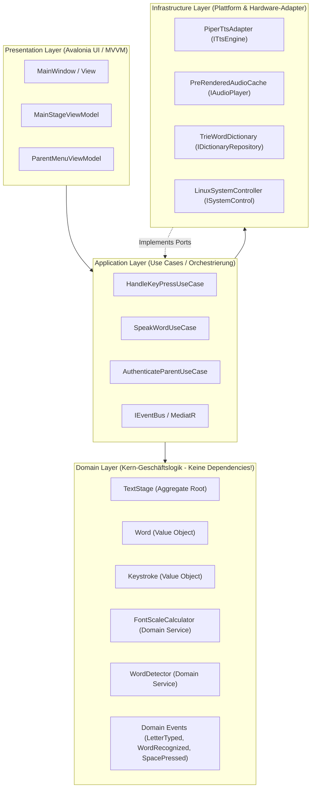

# 01. System-Architektur & DDD-Design 🏛️

> **Architektur-Philosophie:** Clean Architecture, Domain-Driven Design (DDD) und SOLID-Prinzipien.  
> Entkoppelt, hochgradig testbar und von Beginn an für zukünftige Spielmodi (Mathe, Quiz, Animationen) ausgelegt.

---

## 📐 Das Schichten-Modell (Hexagonal / Clean Architecture)

BuchstabenOS trennt die reine Fachlogik (Wie verhalten sich Buchstaben, Wörter und Regeln?) strikt von der Infrastruktur (Audio, Linux-Befehle, X11-Fenster).

---

## 🧩 1. Domain Layer (Das Herzstück)

Der Domain Layer hat **keinerlei externe Abhängigkeiten** (weder zu Linux, noch zu Audio-Bibliotheken oder UI-Frameworks). Er kann zu 100 % isoliert mit Unit-Tests getestet werden.

### Aggregates & Entities

#### `TextStage` (Aggregate Root)
Verwaltet den aktuellen Schreibzustand auf dem Bildschirm:
*   **Properties:**
    *   `IReadOnlyList<char> CurrentLine`
    *   `IReadOnlyList<Word> CompletedWords`
    *   `FontSize CurrentFontSize`
    *   `StageMode CurrentMode` (z. B. `FreeTyping`, `WordCelebration`, `Locked`)
*   **Methoden:**
    *   `ApplyKeystroke(Keystroke key)`: Validiert die Taste, fügt sie zur Zeile hinzu, berechnet neue Schriftgröße und feuert `LetterTypedEvent`.
    *   `CheckForWordMatch()`: Prüft, ob das aktuelle Token im Wörterbuch existiert.
    *   `CommitWordBySpace()`: Schließt das aktuelle Wort ab, triggert die Wort-Aussprache und leert/resettet den Puffer.
    *   `Clear()`: Leert den Bildschirm (z. B. bei Druck auf Backspace oder nach Wort-Aussprache).

### Value Objects
*   **`Word`**: Unveränderliches Objekt, das den Text, die Normalisierung (Großschreibung) und das Flag `IsRecognizedDictionaryWord` kapselt.
*   **`Keystroke`**: Repräsentiert einen Tastendruck inklusive Metadaten (Taste, Modifier wie Ctrl/Alt, Zeitstempel).
*   **`FontSize`**: Kapselt Punktgröße (`pt`), Mindestgröße (`MinSize`) und Maximalgröße (`MaxSize`).
*   **`ParentPin`**: Kapselt die gesicherte PIN zur Authentifizierung im Elternmenü.

### Domain Services
*   **`FontScaleCalculator`**:  
    Berechnet deterministisch anhand der Zeichenlänge, des Bildschirm-Seitenverhältnisses und der Viewport-Breite die optimale Schriftgröße.
    *   *Regel:* $1 \text{ Buchstabe} \rightarrow \text{Maximalgröße}$ (z. B. 240pt).
    *   Mit jedem weiteren Zeichen: Kontinuierliche Verkleinerung.
    *   Unterhalb von 48pt: Signal für Zeilenumbruch.
*   **`WordDetector`**:  
    Nutzt einen internen Trie-Baum oder Hash-Index, um in $O(1)$ bis $O(k)$ zu prüfen, ob die letzten getippten Buchstaben ein gültiges Wort bilden.

### Domain Events
Durch den Einsatz von Domain Events entkoppeln wir Aktionen vollständig von ihren Nebeneffekten:
*   `LetterTypedDomainEvent(char Character, bool IsVowel, DateTime Timestamp)`
*   `WordRecognizedDomainEvent(string Word, bool IsDictionaryWord)`
*   `SpacePressedDomainEvent(string FormedWord)`
*   `ParentMenuRequestedDomainEvent()`
*   `StageClearedDomainEvent()`

---

## ⚡ 2. Application Layer (Use Cases)

Hier liegt die Ablauflogik:
*   **`ProcessInputKeyUseCase`**:
    1. Erhält `Keystroke` von der UI.
    2. Prüft auf geheime Eltern-Tastenkombination (`Ctrl+Shift+P`). Falls ja $\rightarrow$ Event für Eltern-Overlay.
    3. Bei Leertaste $\rightarrow$ `TextStage.CommitWordBySpace()`.
    4. Bei normalem Buchstaben $\rightarrow$ `TextStage.ApplyKeystroke()`.
    5. Delegiert an `IAudioPlayer` zur sofortigen Aussprache des Buchstabens.
    6. Wenn Wort erkannt wird $\rightarrow$ Delegiert an `ITtsService` zur Sprachausgabe des ganzen Wortes.
*   **`AuthenticateParentUseCase`**:
    Validiert die eingegebene PIN gegen den gespeicherten Hash und schaltet das Elternmenü frei.
*   **`ChangeSettingsUseCase`**:
    Ändert Einstellungen wie Lautstärke, Lautier-Modus (Phonetisch vs. Alphabet) oder Sprechgeschwindigkeit.

---

## 🔌 3. Ports & Infrastructure (Plattform-Adapter)

SOLID-Prinzip: **Dependency Inversion (DIP)**. Die Anwendungslogik definiert Schnittstellen (Ports), die Infrastruktur implementiert sie (Adapters).

| Interface (Port) | Implementierung (Adapter) | Verantwortung |
| :--- | :--- | :--- |
| `IAudioPlayer` | `PreRenderedAudioPlayer` | Spielt gecachte WAV-Dateien (Buchstaben A–Z) mit < 10 ms Latenz über ALSA/PulseAudio ab. |
| `ITtsEngine` | `PiperTtsService` | Lokale neuronale Sprachsynthese für dynamische Wörter und Quatschwörter. |
| `IWordDictionary` | `TrieWordDictionary` | Schnelle Wortsuche basierend auf einer bereinigten deutschen Kinder-Wortliste. |
| `ISystemControl` | `LinuxSystemControlService` | Interaktion mit BunsenLabs: Lautstärke (`amixer`/`wpctl`), Neustart, Herunterfahren, X11-Exit. |
| `ISettingsStorage`| `JsonFileSettingsStorage` | Speichert PIN, Lautstärke und Optionen in einer robusten JSON-Datei unter `~/.config/buchstabenos/`. |

---

## 🎮 4. Das modulare Spielesystem & Moderation

BuchstabenOS ist eine vollwertige, erweiterbare Plattform für Vorschul-Lernspiele.

### Die Spiel-Schnittstellen

#### `IGameModule` & `IRenderableGame`
Jedes Spiel (wie `FreeTypingGameModule` oder `AdditionGameModule`) implementiert:
*   **`IGameModule`**: Lifecycle, Metadaten (Pädagogische Skills, Alter, Lernziele), Eingabeverarbeitung (`ProcessInputAsync`), Wissens-Score (`KnowledgeScore`).
*   **`IRenderableGame`**: Visuelle Entkopplung für die UI (`DisplayText`, `CurrentFontSizePoints`, `HintText`, `CompletedLines`, `IsCelebrating`, `IsWrongFeedback`).
*   **`IGameConfigurable`**: Bereitstellung dynamischer Konfigurations-Deskriptoren für das Elternportal (z.B. "Rechnen bis").

#### `AdditionGameModule` (Mathespiel: Addition)
*   Kindgerechte Plus-Aufgaben ($a + b = c$) innerhalb des konfigurierbaren Rahmens (`MaxSum`, Standard: 10).
*   Rotierende Vorlese-Templates ("Kannst du mir sagen, was zwei plus drei ist?").
*   Ziffern-Filter (nur '0'..'9', Backspace, Enter).
*   Automatische Auswertung bei Erreichen der Ziffernlänge.
*   Wiederholung derselben Aufgabe bei Fehlern zur Frustrationsvermeidung.

### 🎲 Der Spiele-Moderator (`IGameModerator` / `WeightedRandomGameModerator`)
*   Überwacht die Aufmerksamkeitsspanne:
    *   **Mathe-Addition:** Wechsel nach **2 gelösten Aufgaben**.
    *   **Buchstaben-Zauber:** Wechsel nach **5 erkannten Wörtern** oder **5 Minuten** aktiver Spielzeit.
*   Würfelt nach Ablauf der Spanne unter Berücksichtigung konfigurierbarer Gewichte (z.B. Mathe 50%, Buchstaben 50%) das nächste Spiel aus.
*   Zukunftssicher: Das Interface kann nahtlos durch einen KI-Tutor / LLM-Agenten ersetzt werden!
