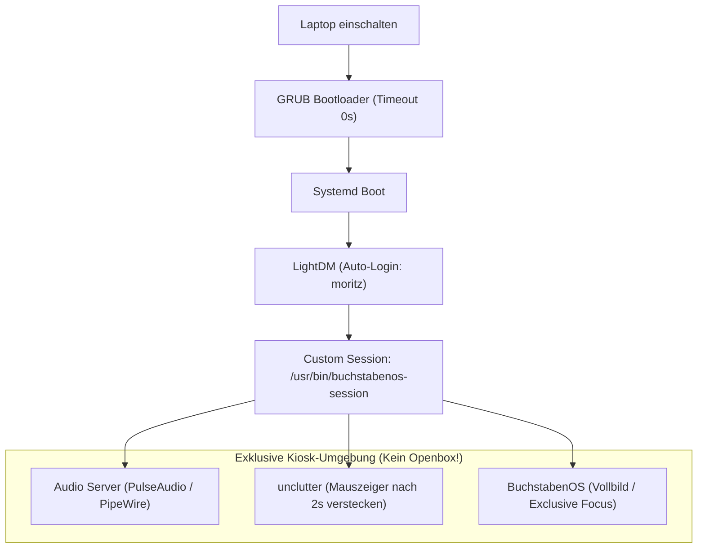

# 03. OS-Integration & Kiosk-Modus 🛡️

> **Die Kernfrage:** Wie startet BuchstabenOS nach dem Einschalten des Lenovo Laptops so, dass Moritz sofort im Spiel ist und das darunterliegende Linux absolut unantastbar bleibt?

---

## 🔍 Die 3 Start-Konzepte im Vergleich

| Konzept | Funktionsweise | Vorteile | Nachteile | Eignung |
| :--- | :--- | :--- | :--- | :--- |
| **a) Desktop-Autostart** *(z. B. BunsenLabs Openbox)* | Benutzer loggt sich automatisch ein; Openbox startet die App via `autostart` im Vollbild. | • Sehr einfach einzurichten.<br>• Audio, WLAN und Energieverwaltung laufen sofort. | • Moritz könnte durch Tastenkombinationen (Alt+Tab, Super-Taste) Openbox-Menüs öffnen.<br>• Fensterrahmen könnten aufblitzen. | ⭐⭐⭐ (Ideal für Entwicklung) |
| **b) Dedizierte X11-Kiosk-Session** *(Eigenständiges Programm)* | LightDM loggt den Benutzer `moritz` ein, startet aber **keinen Window Manager**, sondern direkt einen X11-Server und BuchstabenOS. | • **Absolut kindersicher:** Kein Desktop, kein Terminal, kein Alt+Tab.<br>• Maximale Performance & minimaler RAM-Bedarf.<br>• Volle Debian-Treiber für Audio & WLAN bleiben erhalten. | • Erfordert einmalige Erstellung einer `.desktop`-Session-Datei für LightDM. | 🏆 **Gewinner für Produktivbetrieb!** |
| **c) Eigenes Linux** *(Buildroot / Yocto / Minimal Appliance)* | Eigenes Kernel-Image, das ohne Linux-Distributions-Unterbau direkt in die App bootet. | • Extrem schneller Bootvorgang (~2-3 Sekunden). | • **Riesiger Wartungsaufwand:** WLAN-Firmware (`iwlwifi`), ALSA-Audiotreiber und Energiemanagement müssen manuell gepflegt werden. | ❌ Nicht empfehlenswert |

---

## 🚀 Die empfohlene Architektur: Variante b (X11-Kiosk auf BunsenLabs)

BunsenLabs bringt von Haus aus den Display-Manager **LightDM** und ein sauberes Debian-Fundament mit. Wir nutzen diese Stärke, um eine kugelsichere Kiosk-Umgebung zu schaffen:



---

## 🛠️ Konfigurations-Blaupause für BunsenLabs

### 1. Das Kiosk-Startskript (`/usr/local/bin/buchstabenos-session`)
Dieses Skript wird von LightDM aufgerufen. Es startet Sound, blendet die Maus aus und startet BuchstabenOS in einer Dauerschleife (Restart bei Crash):

```bash
#!/bin/bash
# 1. Bildschirmschoner und Energiesparmodus deaktivieren
xset s off
xset -dpms
xset s noblank

# 2. Mauszeiger bei Inaktivität verstecken
unclutter -idle 2 -root &

# 3. Soundserver sicherstellen
start-pulseaudio-x11 &

# 4. BuchstabenOS im Endlos-Loop ausführen (Selbstheilung bei Absturz)
while true; do
    /opt/buchstabenos/BuchstabenOS --kiosk
    
    # Wenn der Exit-Code 42 ist (Papa hat über Elternmenü beendet):
    if [ $? -eq 42 ]; then
        break
    fi
    sleep 1
done
```

### 2. LightDM Session registrieren (`/usr/share/xsessions/buchstabenos.desktop`)
Damit LightDM weiß, dass es diese Session gibt:

```ini
[Desktop Entry]
Name=BuchstabenOS Kiosk
Comment=Moritz BuchstabenOS Lernspiel Session
Exec=/usr/local/bin/buchstabenos-session
Type=Application
```

### 3. LightDM Autologin einrichten (`/etc/lightdm/lightdm.conf`)
```ini
[Seat:*]
autologin-user=moritz
autologin-user-timeout=0
user-session=buchstabenos
```

---

## 🔒 Kindersicherung: Tasten-Sperren auf OS-Ebene

Moritz wird wild auf die Tastatur hämmern. Damit er nicht versehentlich in ein Linux-Text-Terminal (`TTY`) wechselt oder den X-Server abschießt:

1. **TTY-Umschaltung deaktivieren (`Ctrl+Alt+F1` bis `F6`):**  
   In `/etc/X11/xorg.conf.d/10-kiosk.conf`:
   ```xorg
   Section "ServerFlags"
       Option "DontVTSwitch" "true"
       Option "DontZap" "true"
   EndSection
   ```
2. **Magic SysRq Key sperren:**  
   In `/etc/sysctl.d/99-kiosk.conf`:
   ```ini
   kernel.sysrq = 0
   ```
3. **Mausrad / Touchpad-Gesten:**  
   In BuchstabenOS selbst fangen wir alle Eingabe-Events exklusiv ab.

---

## 👨‍👧 Das Eltern-Portal ("Wie komme ich wieder ins System?")

Damit Alex Wartungsarbeiten, Updates oder WLAN-Konfigurationen vornehmen kann:

1. **Geheime Tastenkombination:** `Strg + Alt + Shift + P`
2. **PIN-Dialog öffnet sich:** Moritz sieht nur Zahlenfelder.
3. **PIN-Eingabe (z. B. `1337`):**
   *   Option A: *Einstellungen anpassen* (Lautstärke, Sprechtempo, Wörterbuch).
   *   Option B: *Zurück zum normalen Desktop* $\rightarrow$ BuchstabenOS beendet sich mit Exit-Code `42`. Das Startskript beendet die Kiosk-Session, und LightDM öffnet den regulären Anmeldebildschirm für Benutzer `alex` (mit vollem Openbox-Desktop).
   *   Option C: *Laptop ausschalten* $\rightarrow$ Sendet sauberen Shutdown-Befehl via `systemctl poweroff`.
