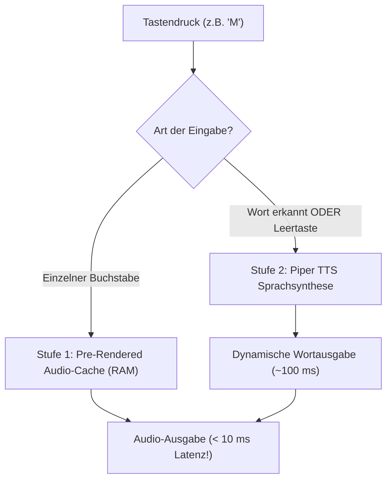

# 04. Sprachausgabe (TTS) & Audio-Pipeline 🎙️

> **Das akustische Geheimnis:** Kinder haben keine Geduld. Ein Tastendruck muss sich so unmittelbar anfühlen wie ein mechanisches Klavier (< 50 ms Reaktionszeit). Hier ist unsere 2-Stufen-Audio-Pipeline.

---

## ⚡ Das 2-Stufen-Latenz-Modell



---

## 🅰️ Stufe 1: Einzelne Buchstaben (Pre-Rendered Audio)

Wenn Moritz auf eine Taste tippt, darf **keine** Sprachsynthese live berechnet werden (das würde auf einer alten CPU 100–300 ms dauern und ein schwammiges Feedback erzeugen).

Stattdessen werden alle 26 Buchstaben, Umlaute (Ä, Ö, Ü, ß) und Ziffern (0–9) **vorab als hochwertige 44.1 kHz WAV-Dateien** im Arbeitsspeicher gehalten.

### 🧠 Pädagogischer Clou: "Lautieren" vs. "Buchstabieren"

In der Pädagogik (Montessori, Vorschule) lernen Kinder das Lesen nicht über Buchstabennamen ("Be", "Tse", "Ka"), sondern über **Laute (Phoneme)**:
*   *Falsch für Leseanfänger:* "Em" - "Ah" - "Em" - "Ah" $\rightarrow$ "EmahEmah"?
*   *Richtig (Lautieren):* "Mmm" - "A" - "Mmm" - "A" $\rightarrow$ "MAMA"!

**BuchstabenOS unterstützt beide Modi (umschaltbar im Elternmenü):**
1.  **Modus "Lautieren" (Default für Vorschulkinder):**  
    Das `B` klingt wie ein kurzes, stimmhaftes `[b]`, das `S` wie `[s]`, das `M` wie `[m]`.
2.  **Modus "Alphabet" (Klassisch):**  
    Aussprache wie im Abc-Lied ("Ah", "Be", "Tse", "De"...).

---

## 🗣️ Stufe 2: Ganze Wörter & Quatschwörter (Piper TTS)

Wenn ein Wort fertig ist oder die **Leertaste** gedrückt wird, greift **Piper TTS**:

*   **Was ist Piper?**  
    Ein hochmoderner, lokaler neuronaler Text-to-Speech-Synthesizer (basierend auf VITS/ONNX). Er benötigt **keine Internetverbindung**, klingt verblüffend menschlich (kein blecherner 90er-Jahre-Roboter) und läuft extrem ressourcenschonend auf x86_64 CPUs.
*   **Empfohlenes deutsches Stimmen-Modell:**  
    *   `de_DE-thorsten-medium` (Sehr natürliche, angenehme männliche Vorlesestimme).
    *   `de_DE-kerstin-low` (Besonders schnelle, leichtgewichtige weibliche Stimme für ältere CPUs).
*   **Dynamischer Wort-Cache:**  
    Einmal gesprochene Wörter (z. B. "PAPA") werden im RAM/Temp-Verzeichnis abgelegt. Wird das Wort erneut getippt, ertönt es mit 0 ms Synthese-Latenz.

---

## 📚 Das Kinder-Wörterbuch (Worterkennung)

BuchstabenOS verfügt über ein integriertes deutsches Kinder-Wörterbuch:

### Datenstruktur: Trie (Präfixbaum)
Ein Trie ermöglicht die Erkennung in $O(k)$ Zeit (wobei $k$ die Wortlänge ist, z. B. 4 Zeichen bei `MAMA`), unabhängig davon, ob das Wörterbuch 100 oder 50.000 Wörter umfasst.

```
       (Wurzel)
       /   \
     [M]   [A]
     /       \
   [A]       [U]
   /           \
 [M]           [T]
 /               \
[A]* (MAMA)      [O]* (AUTO)
```
Sobald Moritz den letzten Buchstaben tippt, der einen Knoten mit dem Sternchen `*` (`IsWordEnd = true`) erreicht, triggert die Domain sofort das `WordRecognizedEvent`.

### Initiale Wortliste (`kinderwoerter.json`)
Die Liste lässt sich jederzeit im Elternmenü um eigene Namen erweitern:
*   Familie: `MAMA`, `PAPA`, `MORITZ`, `OMA`, `OPA`, `BABY`
*   Tiere: `KATZE`, `HUND`, `MAUS`, `KUH`, `PFERD`, `LOEWE`, `BAER`
*   Alltag: `AUTO`, `BALL`, `HAUS`, `BAUM`, `EIS`, `SONNE`, `MOND`, `STERNE`, `BROT`, `MILCH`
*   Farben: `ROT`, `BLAU`, `GRUEN`, `GELB`, `BUNT`

---

## 🔉 Audio-Treiber & Linux-Anbindung

Unter BunsenLabs/Debian binden wir Audio sauber an:
*   **Polyphoner Multitrack-Audioplayer (`LinuxAudioSamplePlayer`):**  
    Kinder tippen ungestüm und schnell. Wenn mehrere Tasten kurz nacheinander gedrückt werden oder wild die Leertaste gehämmert wird, dürfen vorherige Klänge nicht brutal abgewürgt werden. Die Audio-Pipeline trennt Tastatur-Laute und TTS-Wortausgaben auf zwei unabhängige, nicht-blockierende Spuren (unter Linux gemischt via PipeWire `pw-play` bzw. PulseAudio `paplay`).
*   **Benutzerdefinierte Sound-Pfade (User Overrides):**  
    Das System sucht Audio-Dateien in folgender Prioritäts-Reihenfolge:
    1. `~/.config/buchstabenos/sounds/{laute|alphabet|jingles}/` (Benutzer-Aufnahmen haben Vorrang)
    2. `{AppDir}/assets/audio/{laute|alphabet|jingles}/` (Projekt-Assets)
    3. Synthetischer Sinuston (Fallback)
*   **Format-Flexibilität:** Unterstützt `.wav` (Empfehlung: 0 ms Latenz), `.ogg`, `.mp3` und `.flac`.
*   **Kein Sound-Kratzen:** Der Linux-Power-Management-Modus der Soundkarte (`snd_hda_intel power_save`) wird im Kiosk-Setup auf `0` gesetzt, damit die Soundkarte nicht nach 3 Sekunden Inaktivität in den Ruhezustand geht (was zu einem lauten Knacken beim nächsten Tastendruck führen würde).

---

## 🎯 Plan A: Das vorschulgerechte Lautieren (DIY-Sampling)

### Warum TTS bei isolierten Lauten versagt
Neuronale TTS-Modelle (wie Piper / VITS) sind auf ganze Sätze mit Sprachmelodie und Wortkontext trainiert. Isolierte Konsonanten (insbesondere Plosive wie B, P, D, T, G, K) existieren in natürlicher Sprache physiologisch **niemals isoliert**, sondern sind 20–40 ms kurze Druckimpulse im Mund. Ein TTS-Modell versucht daraus künstlich Silben zu machen, was zu abgehackten "Böh"-Lauten oder englischem Buchstabieren ("Biii") führt.

Für die Einzeltasten ist **echtes menschliches Audio-Sampling** der Goldstandard!

### 🎙️ Der Pädagogische Recording-Spickzettel

Beim Einsprechen der Laute (z. B. in Audacity oder einem Audio-Editor) gilt:

| Buchstabe | Aussprache | Pädagogische Regel für Moritz |
| :--- | :--- | :--- |
| **A, E, I, O, U** | `[a]`, `[e]`, `[i]`, `[o]`, `[u]` | Vokale ("Klingler"): Klar und mittellang sprechen. |
| **M, N, L, R, W** | `[mmm]`, `[nnn]`, `[lll]`, `[rrr]`, `[www]` | Dauerlaute: Weich und sanft summen / hauchen. |
| **F, S** | `[fff]`, `[sss]` (wie zischende Luft) | Rein stimmlos, kein "Eff" oder "Ess". |
| **B, D, G** | **Extrem trocken:** `[b]`, `[d]`, `[g]` | **Sehr wichtig:** Kein langes "Böh" oder "Deh"! Nur der kurze Explosivlaut. |
| **P, T, K** | Knackig mit Lufthauch: `[p]`, `[t]`, `[k]` | Die stimmlosen Partner von B, D, G. |
| **C** | `[ts]` (wie Cent/Cäsar) oder `[k]` | Empfehlung für Vorschule: **`[ts]`** (da K bereits existiert). |
| **J** | `[j]` (wie im Wort "Ja") | Kein "Jott". |
| **H** | `[h]` (ein kurzer warmer Hauch) | Kein "Ha". |
| **V** | `[f]` (wie Vogel) | Vorschul-Standard ist `[f]`. |
| **Z** | `[ts]` (wie in Zebra) | Zischend, kein "Zett". |
| **Ä, Ö, Ü** | `[ä]`, `[ö]`, `[ü]` | Sauber und natürlich artikuliert. |
| **ß** | `[sss]` | Scharfes, stimmloses S. |

### 🛠️ Aufnahme & Export-Workflow (5 Minuten)
1. In Audacity alle 30 Laute mit 1–2 Sekunden Pause am Stück einsprechen (44.1 kHz, 16-Bit Mono WAV).
2. Menü: *Analyze $\rightarrow$ Label Sounds* (oder Labels manuell auf die Laute setzen: `A`, `B`, `C`...).
3. Menü: *File $\rightarrow$ Export Multiple* $\rightarrow$ Format: *WAV (Microsoft) 16-bit PCM*.
4. Die erzeugten Dateien einfach nach `assets/audio/laute/` oder `~/.config/buchstabenos/sounds/laute/` kopieren.

---

## 🚀 Plan B: Eigene Piper-Stimme trainieren ("Papa-Stimme")

Während handgemachte Samples perfekt für Einzeltasten sind, ist eine **eigene neuronale Piper-Stimme** die ultimative Krönung für **ganze Wörter, Quatschwörter, Belobigungen und spätere Mini-Geschichten**.

### Die Architektur: Fine-Tuning statt Scratch-Training
Man trainiert heute kein Modell mehr von Grund auf. Stattdessen nutzt man **Transfer Learning (Fine-Tuning)** auf Basis des bestehenden deutschen Checkpoints (`de_DE-thorsten-medium`).

### 1. Datenaufnahme mit `piper-recording-studio`
*   **Benötigte Daten:** Ca. 300 bis 600 kurze Sätze (ca. 30–60 Minuten sauberes Audiomaterial).
*   **Tool:** [Piper Recording Studio](https://github.com/rhasspy/piper-recording-studio) (Open Source).
    *   Startet einen lokalen Webserver im Browser.
    *   Zeigt vorgefertigte deutsche Sätze an.
    *   Taste drücken $\rightarrow$ sprechen $\rightarrow$ Taste loslassen $\rightarrow$ Tool schneidet, normiert und speichert die Datei direkt im LJSpeech-Format (`wavs/0001.wav|Der Hund bellt laut.`).

### 2. Modell trainieren mit PyTorch & CUDA
*   **Hardware:** Lokale NVIDIA GPU (ab 6–8 GB VRAM, z.B. RTX 2060/3060/4060) oder ein kostenloses Google Colab Notebook (T4 GPU).
*   **Vorgehen:**
    1. Repository klonen: `git clone https://github.com/rhasspy/piper.git`
    2. Datensatz phonemisieren:
       ```bash
       python3 -m piper_train.preprocess \
         --language de \
         --input-dir /pfad/zu/recording-studio/dataset/ \
         --output-dir /pfad/zu/training/ \
         --dataset-format ljspeech \
         --single-speaker
       ```
    3. Fine-Tuning starten (lädt bestehendes deutsches Checkpoint):
       ```bash
       python3 -m piper_train \
         --dataset-dir /pfad/zu/training/ \
         --resume_from_checkpoint /pfad/zu/thorsten_checkpoint.ckpt \
         --accelerator gpu \
         --devices 1 \
         --batch-size 16 \
         --max_epochs 1000 \
         --checkpoint-epochs 25
       ```
    4. Trainingszeit: Ca. 1,5 bis 3 Stunden GPU-Zeit.

### 3. Export nach ONNX
Ein einzelner Befehl exportiert das PyTorch-Modell in die performante ONNX-Laufzeitumgebung:
```bash
python3 -m piper_train.export_onnx \
  /pfad/zu/training/lightning_logs/version_0/checkpoints/best.ckpt \
  ~/.local/share/piper/de_DE-alex-papa.onnx
```

### 4. Einbindung in BuchstabenOS
Da `PiperTtsEngine` modular aufgebaut ist, genügt eine einzige Zeile Konfiguration in `~/.config/buchstabenos/settings.json` oder im Code:
```json
{
  "ModelPath": "~/.local/share/piper/de_DE-alex-papa.onnx"
}
```
**Ergebnis:** Moritz tippt `BAGGER` $\rightarrow$ Papas Stimme lobt und liest es vor. Moritz tippt Quatsch `BLUBBERTI` $\rightarrow$ Papas Stimme liest das Quatschwort mit voller Betonung vor!

---

## 🛠️ Praxis-Guide: Installation der Standard-Sprachausgabe (Thorsten)

### 1. Der 1-Klick-Weg (Automatisiertes Skript)
Im Projekt-Repository liegt das Skript `scripts/install-tts.sh`:
```bash
./scripts/install-tts.sh
```
Dieses Skript:
1. Lädt die offizielle eigenständige Piper-Binary für Linux x86_64 herunter und legt sie in `~/.local/bin/piper` ab.
2. Lädt die hochwertige deutsche Vorlesestimme **Thorsten** (`de_DE-thorsten-medium.onnx` und `.json`, ~63 MB) von Hugging Face herunter und speichert sie in `~/.local/share/piper/`.
3. Führt sofort einen Funktionstest über PulseAudio (`paplay`) bzw. ALSA (`aplay`) aus.

### 2. Manueller Weg (Verständnis & Hintergründe)
Falls du es manuell oder systemweit einrichten möchtest:

1. **Binary herunterladen:**  
   Von [GitHub rhasspy/piper](https://github.com/rhasspy/piper/releases) das Paket `piper_linux_x86_64.tar.gz` entpacken:
   ```bash
   tar -xzf piper_linux_x86_64.tar.gz -C ~/.local/bin/
   ```
2. **Deutsche Stimme herunterladen:**  
   Von Hugging Face ([rhasspy/piper-voices](https://huggingface.co/rhasspy/piper-voices)):
   * `de_DE-thorsten-medium.onnx`
   * `de_DE-thorsten-medium.onnx.json`  
   nach `~/.local/share/piper/` kopieren.
3. **Test im Terminal:**
   ```bash
   echo "Hallo Moritz" | piper --model ~/.local/share/piper/de_DE-thorsten-medium.onnx --output-raw | paplay --raw --rate=22050 --channels=1
   ```

### 3. Alternative / Fallback: eSpeak-NG (Der Roboter-Notnagel)
Falls auf extrem alten Laptops selbst 60 MB RAM für neuronale Netze gespart werden sollen:
* Unter Debian / BunsenLabs: `sudo apt-get install espeak-ng`
* Unter Arch Linux: `sudo pacman -S espeak-ng`
* Test: `espeak-ng -v de "Hallo Moritz"`
