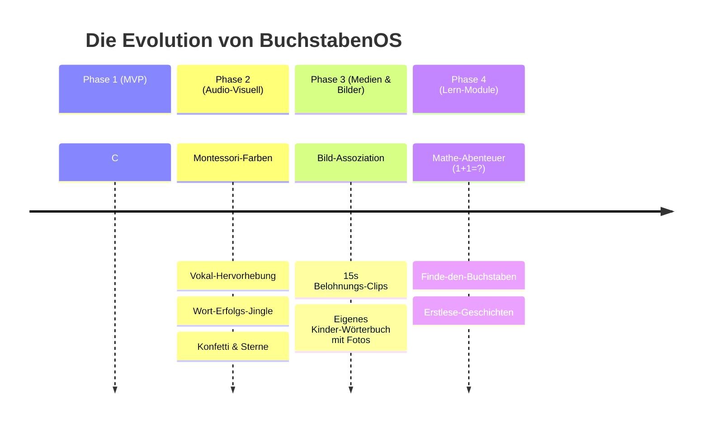

# 06. Roadmap & Zukunftsmodule 🚀

> **Evolutionärer Ausbau:** BuchstabenOS beginnt als stabiler, hochoptimierter Tastatur-Spielplatz und wächst modular mit Moritz' Fähigkeiten mit.

---

## 🗺️ Meilenstein-Übersicht



---

## 🎯 Phase 1: MVP (Der solide Grundstein) – *Fertiggestellt (v1.0)* ✅

*   [x] **Architektur- & Technologie-Konzept:** DDD / SOLID / C# .NET 10 + Avalonia UI.
*   [x] **Clean Architecture Solution:** `Domain`, `Application`, `Infrastructure`, `UI.Desktop` und Unit-Tests.
*   [x] **Buchstaben-Engine & Multitrack-Audio:** Polyphoner Audio-Player (`LinuxAudioSamplePlayer`), Tastentöne schneiden Wortausgaben nicht ab.
*   [x] **Vorschulgerechte Sprachausgabe:** Vorgerenderte Samples für Lautieren vs. Alphabet, User-Overrides unter `~/.config/buchstabenos/sounds/`.
*   [x] **Wort-Erkenner:** $O(k)$ Trie-Wörterbuch für deutsche Kinderwörter (`MAMA`, `PAPA`, `MORITZ`, `AUTO`, `BAGGER`...).
*   [x] **Sprachsynthese:** Lokale neuronale Piper-TTS-Integration für freie Wörter & Leertaste mit Dateicache.
*   [x] **Dynamische Schrift & Zentrierte Bühne:** Stufenlose Skalierung (Groß $\rightarrow$ Klein), zentrierte aktive Zeile, nach oben gleitender Verlauf mit Sanft-Fading ins Tiefschwarz.
*   [x] **Eltern-Menü & PIN:** `Strg+Alt+Shift+P` mit SHA-256 PIN-Schutz (`1337`), Wörterbuch-Editor, Soundeinstellungen und Desktop-Exit (Exitcode 42).
*   [x] **BunsenLabs Kiosk-Skripte:** X11-Session ohne Fenstermanager, Bildschirmschoner-Deaktivierung, Cursor-Verstecken und Selbstheilungsschleife.

---

## 🎙️ Phase 1.5: Die Papa-Stimme & DIY-Soundpacks (v1.1)

*   [ ] **DIY-Sampling der 30 Laute:** Alex spricht die 30 deutschen Anlaute nach pädagogischem Leitfaden ein $\rightarrow$ 0 ms Latenz, maximale Wärme beim Tippen.
*   [ ] **Papa-Stimme in Piper:** Fine-Tuning des Thorsten-Modells mit `piper-recording-studio` und PyTorch/CUDA $\rightarrow$ Moritz tippt Wörter und Papa liest sie mit echter Stimme vor.
*   [ ] **Sound-Pack-Wahl im Elternmenü:** Umschalten zwischen Standard-Stimme, Papa-Stimme oder witzigen Soundeffekten.

---

## 🎲 Phase 1.6: Mathespiel "Addition" & Spiele-Moderation (v1.2) – *Fertiggestellt* ✅

*   [x] **Mathespiel Addition (`AdditionGameModule`):** Kindgerechte Additionsaufgaben ($a+b=c$), zentrierte Großdarstellung, Ziffern-Filter, Auto-Auswertung bei Ziel-Länge oder Enter.
*   [x] **Aufgaben-Vorlesen mit rotierenden Templates:** Z. B. *"Kannst du mir sagen, was zwei plus fünf ist?"*, *"Wenn man zwei und fünf addiert, was ist das richtige Ergebnis?"*.
*   [x] **Fehlertoleranz:** Dieselbe Aufgabe wird bei Fehlern mit liebevoller Ermutigung wiederholt.
*   [x] **Dynamische Spiele-Konfiguration:** Generic Options im Elternportal mit Slider für *"Rechnen bis (Maximales Ergebnis)"* (Standard: 10).
*   [x] **Aufmerksamkeits-Moderator (`WeightedRandomGameModerator`):** Gleichberechtigter Wechsel zwischen Mathe und Buchstaben (Standard: 2 Matheaufgaben, 5 getippte Wörter) mit einstellbarer Würfel-Gewichtung.

---

## 🎨 Phase 2: Pädagogische Farben & Audio-Belohnungen (v1.2)

*   **Montessori-Farbschema:**  
    Automatische Farbgebung der Buchstaben:
    *   **Vokale (A, E, I, O, U):** Sanftes Blau oder Rot (Standard-Lernhilfen).
    *   **Konsonanten:** Warmes Weiß oder Gelb.
*   **Erfolgs-Jingles:**  
    Wenn ein Wort aus dem Wörterbuch erkannt wird, ertönt vor dem gesprochenen Wort ein kurzer fröhlicher Klang (Glockenspiel/Harfe).
*   **Partikel-Effekt:**  
    Feierliche Sterne oder Konfetti sprühen über den Bildschirm, wenn ein Wort vollendet wird.

---

## 🎬 Phase 3: Bilder & Belohnungs-Videos (v2.0)

*   **Bild-Wörterbuch (Visuelle Verknüpfung):**  
    Tippt Moritz `HUND`, erscheint neben dem Wort ein hochauflösendes, freundliches Foto/Icon eines Hundes.
*   **Sternen-Konto & Belohnungs-Videos:**  
    *   Für jedes gefundene Wort gibt es einen goldenen Stern in der oberen Ecke.
    *   Bei 5 Sternen startet eine 15-sekündige kindgerechte Belohnungs-Animation oder ein kurzer Zeichentrick-Clip (z. B. "Sendung mit der Maus" Lachgeschichte / Shaun das Schaf) via hardwarebeschleunigtem Video-Player (`LibVLCSharp`).

---

## 🧮 Phase 4: Das Lern-OS (Mathe & Sprach-Rätsel) (v3.0)

Dank unseres `IGameMode`-Interfaces kann das System im Elternmenü auf neue Module umgeschaltet werden:

1.  **Modul: "Mathe-Zwerg" (Zahlen & Mengen):**
    *   Auf dem Bildschirm erscheinen z. B. 3 Äpfel: `"Wie viele Äpfel siehst du?"`
    *   Moritz drückt die Taste `3` $\rightarrow$ Jubel & Sprachlob: `"Genau! Drei Äpfel!"`.
    *   Erste Plus-Aufgaben: `2 + 1 = ?`.
2.  **Modul: "Buchstaben-Detektiv":**
    *   Die Stimme fragt: `"Moritz, wo versteckt sich das B wie Bär?"`.
    *   Moritz sucht die Taste auf der Tastatur und drückt sie.
3.  **Modul: "Erste Wörter tippen":**
    *   Auf dem Bildschirm steht grau hinterlegt `P A P A`. Moritz tippt die Buchstaben nach (Buchstaben-Tracing).

---

## 🔧 Hardware- & Ergonomie-Tipps für Papas Werkstatt

1.  **Tastatur-Tuning:**  
    Mit farbigen Aufklebern können die Tasten auf dem alten Lenovo Laptop noch greifbarer gemacht werden (z. B. Vokale blau markieren, Leertaste grün, Backspace rot).
2.  **Deckel-Verhalten (Lid Close):**  
    In `/etc/systemd/logind.conf` konfigurieren:
    ```ini
    HandleLidSwitch=suspend
    ```
    Laptop zuklappen = Schlafen; Aufklappen = Sofort wieder im Spiel!
3.  **Power-Button Schutz:**  
    ```ini
    HandlePowerKey=ignore
    ```
    Verhindert, dass Moritz den Laptop mitten im Wort ausschaltet. Ausgeschaltet wird über das Elternmenü oder sanftes Zuklappen.
